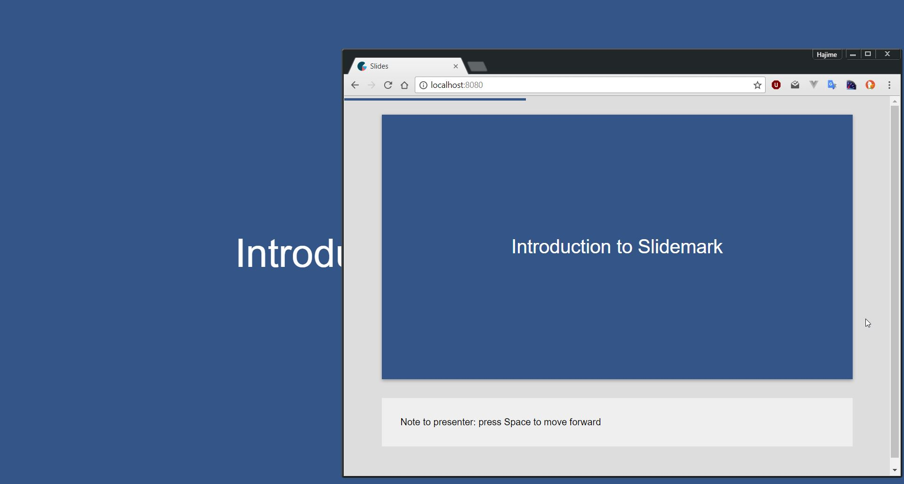

# Slidemark

Slideshow application for the brave and the JavaScript nerds.

## Features

- Slides written in [Markdown](https://daringfireball.net/projects/markdown/)
- Support for presenter notes
- Support for separate presenter and audience views (in separate tabs)
- Fully keyboard-controlled
- Themable with [Stylus](http://stylus-lang.com/)
- Per-slide styling
- Syntax highlighting for source code

Coming soon:

- Customizable transitions
- Bookmarkable slides

## Screenshot



## Setting it up

You will need to have NodeJS and Git installed in order to run this application.

Run the following commands:

```
git clone https://github.com/foxbunny/slidemark.git
cd slidemark
npm install
npm start
```

The first time you start Slidemark, it will fail to compile. This is because you
initially don't have any slides. Follow the instructions in the following
sections for a successful start.

The application will be available at [localhost:8080](http://localhost:8080/).

## Creating the slide index

The slide index is an object that has a required `slides` property, and an
optional `theme` property.

The `slides` property must be an array of slide objects. Each slide object has
the following format:

```javascript
{
  slide: string,  // HTML for the slide
  notes: string,  // (optional) HTML for presenter notes
  lines: number,  // Line count
}
```

This object is automatically created if you `require()` the markdown files. An
index may look like this:

```javascript
module.exports = {
  slides: require('./slides.md'),
}
```

The index should be named `index.js`, and should be placed a `content` folder
inside the source tree along with your markdown files.

If you want to use custom styling, add a theme property to the index:

```javascript
module.exports = {
  slides: require('./slides.md'),
  theme: require('./mytheme.styl'),
}
```

The theme file must be in Stylus format. Look at the
[`src/default-theme.styl`](./src/default-theme.styl) for an example theme.

You can also specify whether the show starts in presenter or audience mode by
adding a `presenter` property which can be either `true` or `false`:

```javascript
module.exports = {
  slides: require('./slides.md'),
  theme: require('./mytheme.styl'),
  presenter: true,
}
```

## Slide format

Slides are written in a single Markdown file.

Individual slides are divided by lines containing at least 4 consecutive pluses:

```
++++
```

It is recommended to use at least 80, though, for clearer separation.

They support GitHub-style code blocks, tables, images, HTML, and the usual
Markdown formatting.

The slides may contain a sections delimited by at least 4 consecutive tildes:

````
~~~~
````

These sections are:

- slide content (required)
- presenter notes
- style

### Presenter notes

A presenter note is some Markdown code that is shown below a slide in the
presenter mode. For example:

```markdown
This is my slide

~~~~

Explain why this slide is so awesome.
```

### Style

Slides can be given additional class names. In the following example, the slide
uses a `special` class. This class can be included in the theme Stylus file to
modify the appearance of the slide.

```markdown
This is my slide

~~~~

Explain why this slide is so awesome.

~~~~

special
```

## Keyboard controls

| Action                            | Key(s)                      |
| --------------------------------- | --------------------------- |
| Next slide                        | `Space` or `Right arrow`    |
| Previous slide                    | `Backspace` or `Left arrow` |
| Toggle presenter/audience mode    | `Enter`                     |
| Back to start                     | `Esc`                       |

## Mouse controls

- Click to advance

## Hosting the slideshow

The slideshow can be built into a stand-alone HTML/JavaScript/CSS bundle and
hosted on a normal HTTP server, GitHub pages, and the like. The build the bundle
run:

```
npm run build
```

The output is dumped into the `build` folder which is created as needed.

## License

This code is made available to you under the terms of the MIT license. See the
LICENSE file in the source tree for more information.
